# Awesome Certificate Transparency Monitoring 🛡️

[](https://github.com/ishandutta2007/Awesome-Certificate-Transparency-Monitoring)

<p align="center">
  <a href="https://github.com/ishandutta2007/Awesome-Awesome-Awesome"></a><a href="https://discord.gg/jc4xtF58Ve"></a>
  <a href="https://github.com/ishandutta2007/Awesome-Certificate-Transparency-Monitoring"></a>
  <a href="https://github.com/ishandutta2007/Awesome-Certificate-Transparency-Monitoring/blob/main/LICENSE"></a>
  <a href="https://github.com/ishandutta2007"></a>
</p>

---

## 📌 Top Certificate Transparency (CT) Monitoring Tools & Ecosystem

A curated list of **SaaS platforms**, **commercial PKI suites**, and **open-source GitHub projects** for continuous **Certificate Transparency (CT) log monitoring**, real-time SSL/TLS certificate discovery, unauthorized issuance detection, phishing domain alerting, and external attack surface management (EASM).

*Last updated: September 2026* 🗓️

---

## 💡 Industry & Market Overview

> 📊 **Estimated Market Size & Structure**: The global **External Attack Surface Management (EASM) and Digital Trust / PKI Security market** is estimated at **$2.8 Billion - $3.5 Billion**, growing at over **18% CAGR**. The sector is **moderately fragmented**: enterprise PKI and certificate lifecycle management are concentrated among mega-vendors like DigiCert, Keyfactor, and Sectigo, while real-time CT log ingestion and attack surface monitoring feature highly specialized SaaS platforms and active open-source solutions.

---

## 📋 Table of Contents

- [☁️ SaaS & Hosted Platforms](#-saas--hosted-platforms)
- [💻 Open-Source GitHub Projects](#-open-source-github-projects)
- [🤝 How to Contribute](#-how-to-contribute)
- [☕ Support](#-support)
- [⚠️ Disclaimer](#%EF%B8%8F-disclaimer)
- [📈 Star History](#-star-history)

---

## ☁️ SaaS & Hosted Platforms

Below is the comparison of top commercial and hosted Certificate Transparency monitoring platforms, sorted by estimated company scale (annual revenue/valuation) in descending order.

| Platform | Company Scale (Revenue / Valuation) 💰 | Starting Tier Price 💲 | Free Tier / Free Trial Limits 🎁 | Key Features & Focus ⚡ |
| :--- | :--- | :--- | :--- | :--- |
| **[DigiCert CT Monitor](https://www.digicert.com/)** | **$1B - $10B** Ann. Revenue | **$450/year** (Trust Lifecycle Manager base) | **30-day enterprise free trial** with full TLS log inventory access | Real-time CT log ingestion, automated domain watchlist matching, CAA enforcement, SIEM/SOAR alert routing. |
| **[Keyfactor CT Monitor](https://www.keyfactor.com/)** | **$1.3B** Valuation / **>$200M** ARR | **$12,000/year** (Command platform subscription) | **30-day free trial** of Command & EJBCA Enterprise | Enterprise PKI governance, browser CT compliance verification, machine identity automation. |
| **[Sectigo CT Log Monitor](https://www.sectigo.com/)** | **$100M - $250M** Ann. Revenue | **$400/year** (Sectigo Certificate Manager) | **30-day free trial** for enterprise account evaluation | Streaming CT logs directly into Datadog & SIEMs, proactive rogue cert alerts, multi-CA management. |
| **[Censys](https://censys.com/)** | **$250M - $500M** Valuation (~$45M Rev) | **$100/month** (Starter tier credit bundle) | **Free Forever**: 100 credits/month (20 standard / 12 regex queries) | Complete internet-wide TLS scan history, historic CT archive, autonomous system & BGP mapping. |
| **[Detectify](https://detectify.com/)** | **$28.9M** ARR | **$70/month** (Surface Monitoring module) | **14-day free trial** with full asset discovery features | Passive DNS combined with CT monitoring for shadow IT & forgotten subdomain detection. |
| **[Red Sift Certificates](https://redsift.com/)** | **$19.2M** ARR | **$1,490/year** (Basic Certificate Governance) | **14-day free trial** with webhook alert integrations | Continuous CT ingestion since 2017, CAA policy auditing, automatic issue tracking per domain. |
| **[SSLMate Cert Spotter](https://sslmate.com/certspotter)** | **$2M - $5M** Ann. Revenue (Est.) | **$15/month** ($150/year) | **30-day free trial**; API offers **100 single-host & 10 full-domain queries/hr free** | Zero-setup web dashboard, instant email/webhook alerts, custom watchlist management. |
| **[Spyse](https://spyse.com/)** | **$1M - $3M** Ann. Revenue (Est.) | **$49/month** (Standard API plan) | **Free Forever**: 50 credits/month upon free account registration | Deep certificate search API filtering by fingerprint (SHA256), subject org, and validity. |

---

## 💻 Open-Source GitHub Projects

The open-source ecosystem for CT log processing, certificate parsing, and stream filtering is production-ready. Repositories below are sorted by **GitHub Stars_Count** (descending).

| Project & Repository | GitHub_Stars 🌟 | Primary Language / Stack 🛠️ | Description & Strengths 🚀 |
| :--- | :--- | :--- | :--- |
| **[Sublist3r](https://github.com/aboul3la/Sublist3r)** | [](https://github.com/aboul3la/Sublist3r/stargazers) | Python 🐍 | Fast OSINT subdomain discovery tool that enumerates subdomains using Certificate Transparency logs (crt.sh, CertSpotter) alongside search engines. |
| **[CTFR](https://github.com/UnaPibaGeek/ctfr)** | [](https://github.com/UnaPibaGeek/ctfr/stargazers) | Python 🐍 | Lightning-fast subdomain discoverer using CT log abuse via crt.sh API without sending requests to target hosts. |
| **[phishing_catcher](https://github.com/x0rz/phishing_catcher)** | [](https://github.com/x0rz/phishing_catcher/stargazers) | Python 🐍 | Catches potential phishing domains in real-time by monitoring the CertStream CT log feed using fuzzy score matching algorithms. |
| **[google/certificate-transparency-go](https://github.com/google/certificate-transparency-go)** | [](https://github.com/google/certificate-transparency-go/stargazers) | Go 🐹 | Official Google Certificate Transparency Go core libraries, tools, and reference log auditor implementations. |
| **[Cert Spotter](https://github.com/SSLMate/certspotter)** | [](https://github.com/SSLMate/certspotter/stargazers) | Go 🐹 | Database-free CT log monitor from SSLMate. Uses a custom resilient certificate parser to ensure no certificates are missed. |
| **[CaliDog/certstream-server](https://github.com/CaliDog/certstream-server)** | [](https://github.com/CaliDog/certstream-server/stargazers) | Elixir 💧 | The original real-time CT log aggregator streaming parsed certificate data to WebSocket clients globally. |
| **[Sunlight](https://github.com/FiloSottile/sunlight)** | [](https://github.com/FiloSottile/sunlight/stargazers) | Go 🐹 | Next-generation static CT log server implementation by Filippo Valsorda & Let's Encrypt using tiled log architecture for CDN caching. |
| **[ct-woodpecker](https://github.com/letsencrypt/ct-woodpecker)** | [](https://github.com/letsencrypt/ct-woodpecker/stargazers) | Go 🐹 | Specialized monitor developed by Let's Encrypt to detect operational anomalies, lagging logs, and bugs in public CT logs. |
| **[certstream-server-go](https://github.com/d-Rickyy-b/certstream-server-go)** | [](https://github.com/d-Rickyy-b/certstream-server-go/stargazers) | Go 🐹 | High-performance Go replacement for CertStream server. Consumes ~40MB RAM and processes 300+ certs/sec with Prometheus metrics. |
| **[certstream-js](https://github.com/CaliDog/certstream-js)** | [](https://github.com/CaliDog/certstream-js/stargazers) | JavaScript 📜 | Node.js / Browser client library for connecting to CertStream real-time WebSocket feeds. |
| **[ct-monitor](https://github.com/jonaslejon/ct-monitor)** | [](https://github.com/jonaslejon/ct-monitor/stargazers) | Python 🐍 | Simple CT monitor script to extract domains, IPs, and email addresses from CT streams with slack notification support. |
| **[certslurp](https://github.com/chtzvt/certslurp)** | [](https://github.com/chtzvt/certslurp/stargazers) | Python 🐍 | Distributed scraper engineered to slurp and store billions of CT log entries at high velocity into PostgreSQL. |

---

## 🛠️ Open-Source CT Monitoring Architecture

```
                                  ┌────────────────────────┐
                                  │  Public CT Logs        │
                                  │ (Let's Encrypt, Cloudflare)
                                  └───────────┬────────────┘
                                              │
                                              ▼
                                 ┌──────────────────────────┐
                                 │  certstream-server-go    │
                                 │  (Real-Time Ingestion)   │
                                 └────────────┬─────────────┘
                                              │ WebSocket Feed
                        ┌─────────────────────┴─────────────────────┐
                        ▼                                           ▼
             ┌─────────────────────┐                     ┌─────────────────────┐
             │  phishing_catcher   │                     │    Cert Spotter     │
             │ (Phishing Detection)│                     │ (Domain Watchlist)  │
             └──────────┬──────────┘                     └──────────┬──────────┘
                        │                                           │
                        ▼                                           ▼
             ┌─────────────────────┐                     ┌─────────────────────┐
             │ Telegram/Slack Alert│                     │ Webhook / SIEM Log  │
             └─────────────────────┘                     └─────────────────────┘
```

---

## 🤝 How to Contribute

Contributions are welcome! To add or update an entry:

1. Fork this repository 🍴
2. Modify `README.md` (maintain standard Markdown tabular formatting).
3. Ensure open-source projects include Stars_Count badge syntax linking to stargazers:
   `[](https://github.com/owner/repo/stargazers)`
4. Open a Pull Request 🚀 with a brief explanation of the tool.

---

## ☕ Support

If you find this repository helpful, please consider starring 🌟, sharing, or supporting the project!

- ⭐️ **Star the Repository**: Click the star button at the top of the page!
- 🔀 **Fork & Share**: Share it with your security team & DevOps colleagues.
- 💖 **Sponsor / Buy Me a Coffee**: Support ongoing open-source updates via the [GitHub Sponsor Dashboard](https://github.com/sponsors/ishandutta2007).

---

## ⚠️ Disclaimer

- This list is community-curated for security research, threat hunting, and infrastructure management.
- Certificate Transparency monitoring tools handle sensitive domain information; ensure proper authorization and CAA policy compliance.

---

## 📈 Star History

[](https://star-history.dera.page/#ishandutta2007/Awesome-Certificate-Transparency-Monitoring&type=date&legend=top-left)
